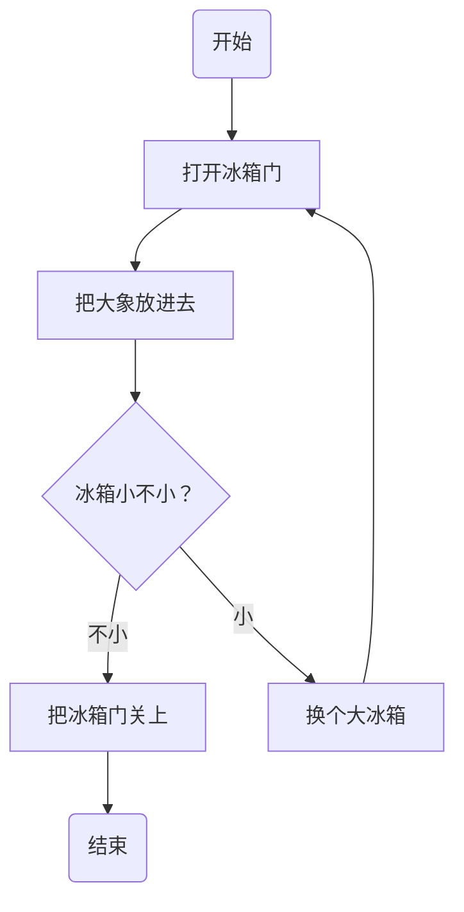
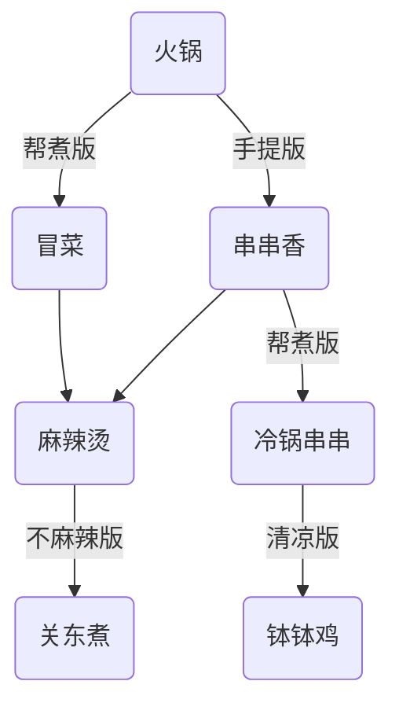

## 流程图

| 代码             | 布局     |
| ---------------- | -------- |
| TB（Top Bottom） | 从上向下 |
| BT（Bottom Top） | 从下向上 |
| LR（Left Right） | 从左向右 |
| RL（Right Left） | 从右向左 |

```mermaid
graph TB
Start(开始)-->Open[打开冰箱门]
Open-->Put[把大象放进去]
Put-->IsFit{"冰箱小不小？"}

IsFit-->|不小|Close[把冰箱门关上]
Close-->End(结束)

IsFit-->|小|Change[换个大冰箱]
Change-->Open
```

```mermaid
graph TB
A(火锅)
A-->|帮煮版|B(冒菜)
A-->|手提版|C(串串香)
B-->D(麻辣烫)
C-->D
C-->|帮煮版|E(冷锅串串)
E-->|清凉版|F(钵钵鸡)
D-->|不麻辣版|G(关东煮)
```